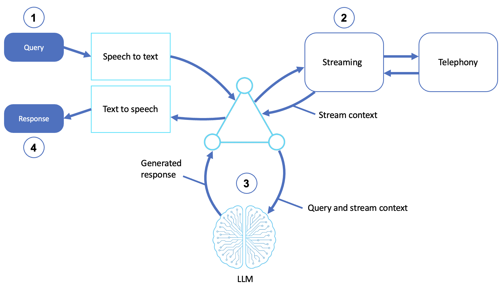

# Giving Agents a Voice: Speech-to-Speech and the STT/TTS Pipeline

*Let users talk to your agent — and have it talk back — through real-time streaming or a turn-based speech pipeline*

---

This is the sixth post in our series on [AWS Prescriptive Guidance for Agentic AI Patterns](https://docs.aws.amazon.com/prescriptive-guidance/latest/agentic-ai-patterns/). Each post focuses on the concepts and patterns behind a single agent type, paired with a [hands-on sample on GitHub](README.md).

## Introduction

The [previous post](https://github.com/aws-samples/sample-coding-agents/blob/main/Coding%20Agents%20-%20From%20Autocomplete%20to%20Autonomous%20Software%20Work.md) had agents reading and writing code; this one changes the channel entirely. The most natural interface humans have is speech: a voice agent lets someone *talk* to your system and hear it answer, which matters enormously for hands-free settings, accessibility, telephony, and any device without a keyboard.

Voice adds a hard constraint that text doesn't: **time**. A typed answer can arrive whenever; a spoken one has to feel immediate, flow naturally, and ideally let the user interrupt. Meeting that constraint is what separates a clunky voice menu from a conversation that feels human.

By the end of this post, you'll understand:
- The two architectures for voice agents: turn-based pipeline and real-time speech-to-speech
- How speech-to-text, LLM reasoning, and text-to-speech fit together
- Why latency and interruption handling make voice uniquely demanding
- When a voice interface is the right choice

---

## The Road to Voice Agents: A Brief History

Talking to computers is an old dream that only recently started to feel natural.

### Touch-tone and scripted IVR

The first "voice" systems weren't really voice at all. Interactive voice response (IVR) menus, "press 1 for billing", used touch-tone (DTMF) signals and rigid decision trees. Later systems added narrow speech recognition for a fixed vocabulary, but they still followed scripts.

### The cascaded STT → NLU → TTS pipeline

As speech recognition and synthesis matured, voice systems became a **pipeline**. As speech-to-text (STT) transcribed what you said, a natural-language understanding layer decided what to do and text-to-speech (TTS) spoke the answer. On AWS, [Amazon Transcribe](https://aws.amazon.com/transcribe/) handles the STT step and [Amazon Polly](https://aws.amazon.com/polly/) the TTS step. This was a huge leap in flexibility but the stages run in sequence, so the user waits for each one, and the system can't listen while it talks.

### Real-time speech-to-speech (2024-2025)

The newest models collapse that pipeline. A speech-to-speech model like [Amazon Nova Sonic](https://aws.amazon.com/ai/generative-ai/nova/speech/) streams audio in and out continuously, handling understanding and generation in one bidirectional flow. Because it listens and speaks at the same time, the user can interrupt mid-sentence and the agent stops and adjusts. It also preserves things a transcript throws away: tone, pacing, and emphasis carry through the audio instead of being flattened into text and regenerated, so the result sounds less robotic.

---

## Two Architectures

| | Turn-based pipeline | Real-time speech-to-speech |
|---|---|---|
| Flow | STT → LLM → TTS, in sequence | Continuous bidirectional audio stream |
| Feels like | Walkie-talkie (one side at a time) | Phone call (both sides at once) |
| Interruptions | Not really | Yes — interrupt mid-response |
| Building blocks | Transcribe + Amazon Bedrock + Polly | Nova Sonic |
| Best when | One direction needed, or mixing services | Natural, low-latency conversation |

The **turn-based pipeline** is simpler and lets you use the pieces independently: just TTS (text in, speech out), just STT (speech in, text out), or chain them. The **real-time** approach is what you reach for when the interaction should feel like talking to a person.

---

## What Makes Voice Hard

Two things make voice agents demanding in ways text agents aren't.

The first is **latency**. In text, a two-second pause is invisible. In speech, it's an awkward silence that makes the agent feel broken. Real-time architectures fight this by streaming rather than waiting for a complete answer and then synthesizing it.

The second is **turn-taking**. Humans interrupt, talk over each other, and pause naturally. A good voice agent has to detect when the user has finished speaking (endpointing), stop talking when interrupted, and pick the conversation back up. The agent might accidentally cut the user off or ramble past their interruption. There's even a physical wrinkle: without headphones, the agent hears its own voice through the microphone and interrupts itself.

A subtler point: responses should be *written for the ear*. The same answer that reads well on screen can be unlistenable aloud, so voice agents need prompts tuned for speech.

Robustness is the other half of the problem. Speech recognition is imperfect, all the human accents, homophones, background noise, and crosstalk start to introduce errors before the LLM ever sees the text. A resilient voice agent expects misheard words, confirms important details ("you said account ending in 4-7-2-1, correct?"), and offers a fallback path when recognition fails repeatedly.

---

## When to Use Voice Agents

Voice is the right interface when speaking is more natural.

| Use Case | Example |
|----------|---------|
| **Conversational IVR** | Replacing rigid phone menus with natural dialogue |
| **Virtual receptionists** | Appointment scheduling and call routing |
| **Voice helpdesks** | Spoken support and troubleshooting |
| **Wearables** | Assistants on devices with no screen |
| **Accessibility & smart homes** | Hands-free control and navigation |

### When to Use Something Else

Voice isn't free. It adds latency budgets, audio infrastructure, and failure modes (background noise, accents, mishearing) that text simply doesn't have. If your users are at a keyboard and precision matters, text is faster and less error-prone. Reach for voice when hands-free, real-time, or accessibility needs make speaking the better channel, not by default.

---

## What's Next

You now understand the two voice architectures, how STT, reasoning, and TTS fit together, and why latency and turn-taking make voice uniquely demanding. The natural next step is to hear it run. The **[companion sample](README.md)** builds a real-time Nova Sonic assistant and a turn-based Polly/Transcribe pipeline.

So far our agents have each done one job in one turn. In the [next post](https://github.com/aws-samples/sample-workflow-orchestration-agent/blob/main/Orchestrating%20Agents%20-%20Sequential%2C%20Parallel%2C%20and%20Conditional%20Workflows.md), we'll coordinate multiple steps deliberately using sequential, parallel, and conditional workflow orchestration.

---

## Resources

- [Companion sample: Speech and Voice Agents](README.md)
- [AWS Prescriptive Guidance - Speech and voice agents](https://docs.aws.amazon.com/prescriptive-guidance/latest/agentic-ai-patterns/speech-and-voice-agents.html)
- [Amazon Nova Sonic](https://aws.amazon.com/ai/generative-ai/nova/speech/)
- [Amazon Polly](https://aws.amazon.com/polly/)
- [Amazon Transcribe](https://aws.amazon.com/transcribe/)
- [Strands Agents Documentation](https://strandsagents.com/)
- [Amazon Bedrock User Guide](https://docs.aws.amazon.com/bedrock/latest/userguide/what-is-bedrock.html)

---

**Tim Sitze** is a Solutions Architect at Amazon Web Services, where he works with cybersecurity ISVs to design and scale their products on AWS. He specializes in security, AI/ML, IoT and data platform architectures, and has partnered on workloads spanning identity threat intelligence, agentic AI, and cloud-native security operations. Tim is based in the Washington, D.C. area.  
